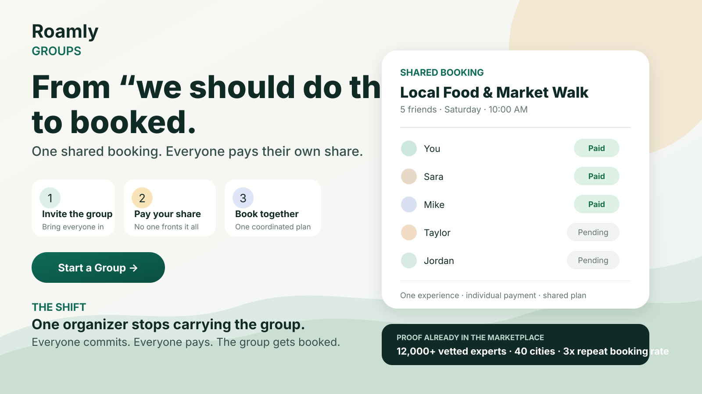

# Messaging Pillars & AI-Generated Asset - Roamly Groups

> Module 4 · Deliver Messaging That Captivates Customers · Deliverable 4

## 1. Fro/To market shift

| | |
|---|---|
| **From - life before** | Group experiences are planned together but transacted individually. One person ends up chasing decisions, coordinating availability, fronting the money, and stitching together chats, bookings, and payment apps. |
| **To - life after** | Group experiences become shared commitments. Each traveler can join and pay their share while the group moves together from "we should do this" to one confirmed experience. |

**Messaging idea:** Roamly Groups turns group interest into shared commitment.

## 2. Audience segmentation

- **Number of audiences that need their own pillar:** 3
- **Why:** The product-led loop depends on three different behaviors. The organizer initiates, invited travelers commit, and the local host fulfills. Each audience experiences a different job and therefore needs a different promise.

### Audience 1 - Group organizer

The beachhead user from the positioning work. This person feels the coordination and payment burden most directly.

### Audience 2 - Invited traveler / group member

The person Roamly acquires through the organizer's invitation. Their job is not to manage the group. It is to understand the experience, commit, and pay with minimal friction.

### Audience 3 - Local host / expert

The supply-side participant who must fulfill the group experience reliably. Their value is clearer, more coordinated demand rather than organizer convenience.

## 3. Messaging pillars

### Pillar - Audience 1: Group organizer

| Layer | Message |
|---|---|
| **Value prop** | **Get the group from "we should do this" to booked and paid without becoming everyone's planner, payment collector, and bank.** |
| **Capabilities** | Create one group booking around a Roamly experience, invite the group, split payments, and keep the shared itinerary in one place. |
| **Evidence** | Roamly already sees users coordinating group bookings across separate accounts, manually splitting payments, and synchronizing availability, with high drop-off in these sessions. The marketplace already has **12,000+ vetted local experts across 40 cities**, and repeat booking is **3x the industry average**. |

### Pillar - Audience 2: Invited traveler / group member

| Layer | Message |
|---|---|
| **Value prop** | **Join the experience, commit, and pay your share without taking on the rest of the group's logistics.** |
| **Capabilities** | Join the organizer's group booking, see the shared experience and itinerary, and pay your own share within Roamly. |
| **Evidence** | Today's workaround already requires travelers to coordinate across separate accounts and external payment tools. The launch must validate invite acceptance, payment completion, and participant drop-off versus the current flow. |

### Pillar - Audience 3: Local host / expert

| Layer | Message |
|---|---|
| **Value prop** | **Turn group interest into a clearer, more coordinated booking without becoming the group's coordinator.** |
| **Capabilities** | One group reservation, coordinated availability, and a shared itinerary rather than fragmented traveler activity. |
| **Evidence** | Roamly already has **12,000+ vetted local experts across four continents**, giving it an established supply base for testing group demand. Host-specific outcomes still need validation, especially booking completion, attendance reliability, cancellations, and coordination burden. |

## 4. Activation across surfaces

These surfaces fit the PLG motion because they cover the organizer's decision point and the participant acquisition moment.

| Surface | Copy variation |
|---|---|
| **Homepage / experience page** | **From "we should do this" to booked.** One shared booking for your group. Everyone joins and pays their own share. |
| **In-app organizer prompt** | **Don't put it all on your card.** Start a Group so everyone can pay their own share. |
| **Participant invite / email** | **Your spot. Your share. One group booking.** Join the experience and pay your part. |

**Surface lesson from peer review:** context determines what should lead. The homepage must first make the offering understandable. In-app and invite surfaces can lead with relief because the user already has context.

## 5. AI-generated asset

- **Asset type:** Launch / homepage hero concept for the organizer pillar
- **Prompt used:** Create a clean, executive-ready Roamly Groups launch visual centered on the organizer. Lead with "From 'we should do this' to booked." Show one shared group booking, invitations, individual share payment, and visible participant status. Include only scenario-supported proof: 12,000+ vetted local experts, 40 cities, and 3x industry-average repeat booking.
- **Output:** 
- **What I edited and why:** I kept the asset centered on the organizer outcome rather than generic travel inspiration. I made the booking and payment flow visible so a cold reader can infer what the product does. I used only scenario-supported proof points and avoided stronger promises such as "nobody drops out" or "joining takes one tap" because those have not been proven.

## 6. Blind-read result

Peer feedback confirmed that the core message is landing, but also highlighted where proof matters.

| Question | What the cold reader understood |
|---|---|
| **Who is it built for?** | The person organizing an activity for a small group of friends, especially the one who would otherwise coordinate everyone and front the money. |
| **What does the product do?** | It puts the group into one coordinated booking while letting each traveler join and pay their own share. |
| **What makes you trust it?** | The workflow is concrete, but the message needs visible proof. The strongest available proof is Roamly's **12,000+ vetted experts, presence in 40 cities, and 3x industry-average repeat booking rate**. Those proof points are therefore surfaced directly in the asset. |

## Final messaging system

**Organizer initiates → traveler commits → host fulfills**

**Umbrella message:** **Roamly Groups turns group interest into shared commitment.**

**Organizer headline:** **From "we should do this" to booked.**

## Link to full artifact

- Messaging asset: [assets/launch-asset.svg](assets/launch-asset.svg)
